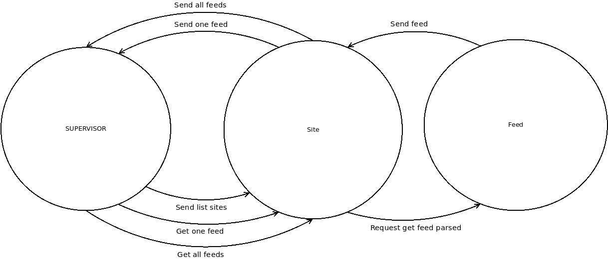
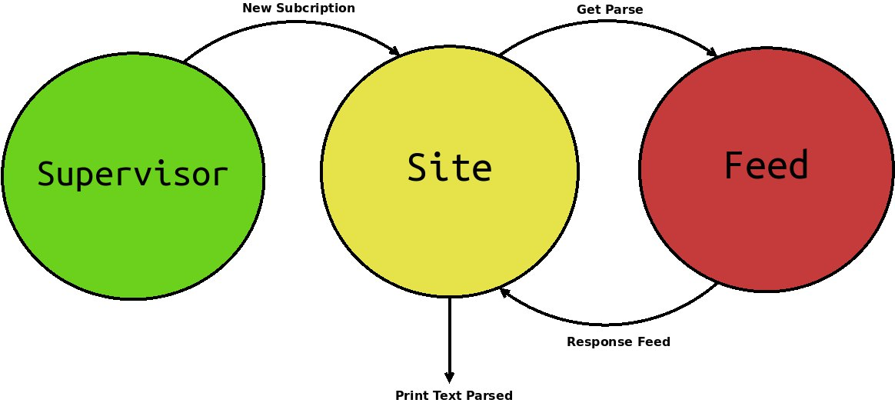
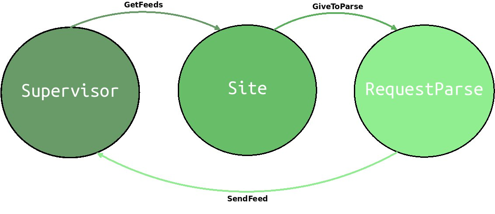

# Alumnos
- Silva, Agustín
- Spitale, Alejandro Claudio
- Vispo, Valentina Solange

# Contenido
- [Alumnos](#alumnos)
- [Contenido](#contenido)
- [Importante](#importante)
  - [1. Primera parte: Diseñando la arquitectura](#1-primera-parte-diseñando-la-arquitectura)
  - [3. Tercera parte: Request-Response](#3-tercera-parte-request-response)
      - [Respuesta 1](#respuesta-1)
  - [5. Quinta parte: Investigación](#5-quinta-parte-investigación)
      - [Respuesta 1](#respuesta-1-1)
      - [Respuesta 2.1](#respuesta-21)
      - [Respuesta 2.2](#respuesta-22)
      - [Respuesta 3](#respuesta-3)
      - [Respuesta 4](#respuesta-4)
- [Extra: nuestra forma de trabajar](#extra-nuestra-forma-de-trabajar)
  - [Cómo correrlo](#cómo-correrlo)

---
# Importante
No quisimos crear una branch aparte para el punto estrella **Suscripción a Reddit/JSON*** porque era muy poco código.
Para probarlo añadimos un `subscriptions2.json` con una url="reddit" y las rss anteriores.

## 1. Primera parte: Diseñando la arquitectura
Diseño inicial de la arquitectura (ver en navegador por las dudas):

En este diseño lo primero que habíamos pensado fue los actores necesarios eran **Supervisor, Site y Feed** que se comunicarían de la siguiente manera:

Supervisor -> Site
- Mandar la lista de sitios al actor `Site`
- Pedir un feed al actor `Site`
- Pedir todos los feed al actor `Site`

Site -> Feed
- Pedido de feed al actor `Feed`

Feed -> Site
- Envía el feed parseado al actor `Site`

Site -> Supervisor
- Enviar todos los feeds al actor `Supervisor`
- Enviar un feed al actor `Supervisor`

La descartamos por que decidimos un mejor diseño al tratar de implementar este porque había una forma más simple de pedir los feeds en un solo mensaje.

Segundo diseño de la arquitectura (ver en navegador por las dudas):

En este diseño habíamos pensado la implementación de `ask` para poder checkear que los mensajes hayan sido recibidos o no cada vez que era "importante" hacerlo.
La comunicación entre los actores era `Supervisor -> Site -> Feed -> Site`
Y al final el Site imprime todos los feeds.

Diseño final de la arquitectura (ver en navegador por las dudas):

En este diseño descartamos la idea de utilizar `ask` ya que era *innesesario* perder la asincronía de los actores ya que esto les da velocidad.

---
## 3. Tercera parte: Request-Response
> Justificar en el informe la decisión tomada y actualizar, de ser necesario, el protocolo de mensajes y su utilidad.

Al principio con la arquitectura 1 y 2 tratamos de utilizar `ask` pero presentamos bastantes problemas con el hecho de sincronizar los actores (mensajes recibidos, mensajes enviados) y nos fue casi imposible debugear el código para el error de `DeadLetters` (que ocurre cuando se trata de enviar un mensaje a un actor que ya no existe porque el sistema lo mató).

Debido a esto planteamos una nueva arquitectura para prescindir del ask y la sincronicidad.

Utilizamos el patrón de interacción `!` para comunicarse entre actores, enviando los mensajes directamente sin necesidad de confirmación, para hacerlo lo más asíncrono posible. Este método no nos asegura que los mensajes siempre lleguen, además *no sabemos en qué momento van a llegar*.

El método que utilizamos fue el siguiente:

**Supervisor**: El supervisor ahora tiene 3 mensajes(`JsonSubs`, `SendFeed`, `Stop`), y se encarga de spawnear un actor para cada sitio que le pasen.

**Site**: El site tiene un mensaje(`GetFeeds`), el cual se encarga de manejar cada feed de un sitio, delegando el trabajo a RequestParse.

**RequestParse**: El request parse tiene un mensaje(`GiveToParse`), y una vez que parsea una url se la manda (`SendFeed`) al Supervisor.

> 1. ¿Por qué es necesario este comportamiento? (ejemplificar).

#### Respuesta 1

Este comportamiento es necesario porque necesitamos crear por cada *sitio* un *actor* que maneje los feeds. Y por cada *sitio*, necesitamos *sub-actores* que se encargen de hacer los **RequestHTTP** y el **parseo**.

---

## 5. Quinta parte: Investigación

> 1. Si quisieran extender el sistema para soportar el conteo de entidades nombradas del laboratorio 2, ¿qué parte de la arquitectura deberían modificar? Justificar.
#### Respuesta 1
Para extender el sistema para soportar el conteo de entidades se debería modificar de la arquitectura lo siguiente:

Creariamos un nuevo actor `CountEntity` dentro del actor `RequestParse`, cada vez que se parsea una *url*. Este nuevo actor se encargaría de contar las entidades nombradas y luego enviar los resultados al `Supervisor`, quien unificaría todas las entidades en una única lista.

1. Si quisieran exportar los datos (ítems) de las suscripciones a archivos de texto (en lugar de imprimirlas por pantalla):
> 2.1. ¿Qué tipo de [patrón de interacción](https://doc.akka.io/docs/akka/current/typed/interaction-patterns.html#interaction-patterns) creen que les serviría y por qué? (hint: es mejor acumular todo los items antes de guardar nada).

#### Respuesta 2.1
Creemos que es el patrón [ask sin status](https://doc.akka.io/docs/akka/current/typed/interaction-patterns.html#request-response-with-ask-between-two-actors) o [ask con status y un error más](https://doc.akka.io/docs/akka/current/typed/interaction-patterns.html#generic-response-wrapper), porque necesitamos tener todos los feeds antes de exportarlo al archivo.

> 2.2. ¿Dónde deberían utilizar dicho patrón si quisieran acumular todos los datos totales? ¿Y si lo quisieran hacer por sitio?
#### Respuesta 2.2
Si quisieramos todos los datos totales lo deberiamos hacer desde el `Supervisor`, y si fuera por sitio, hacerlo en `Site`.

> 3. ¿Qué problema trae implementar este sistema de manera síncrona?

#### Respuesta 3
Los problemas que presenta implementarlo de manera síncrona son:
- reduccion en la velocidad del sistema,
- complejidad en la implementación,
- dificultad en el debugeo,
- es necesario asegurarse que los mensajes son recibidos.

> 4. ¿Qué les asegura el sistema de pasaje de mensajes y cómo se diferencia con un semáforo/mutex?

#### Respuesta 4
Nos asegura que el sistema no va a bloquearse, a diferencia de semáforo/mutex.
Se diferencia del semáforo/mutex porque usa mensajes para la concurrencia.

El modelo de actor opera con el pasaje de mensajes. Los procesos individuales (actores) pueden enviarse mensajes de forma asincrónica entre sí. No existen estados compartidos, ya que cada actor trabaja de manera independiente, por lo que el fallo de uno en el sistema, no afectaría al resto. (En el sentido de que el sistema puede seguir funcionando.)

---
# Extra: nuestra forma de trabajar

> En el archivo [todo.md](todo.md) se encuentran las diferentes consignas y tareas que realizabamos (no siempre es commiteado)

Proceso:
1. Plantear ideas de la implementación
2. Debatir ideas (pros y contras)
3. Tomar una idea
4. Implementar la idea (código)
5. Testearla en los casos necesarios
6. Si funciona, commitearla, sino explicar por qué no funcionó a los demás integrantes
7. Documentarla en un archivo `.txt` en caso de ser necesario (implementación rebuscada o implementación fuera de la idea tomada)

## Cómo correrlo

Forma 1:

sbt "run --input ./subscriptions.json"

Forma 2:

sbt

compile

run --input ./subscriptions.json

Punto estrella 1:

run --input ./subscriptions2.json
